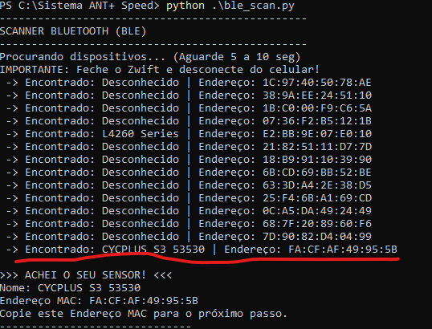

# 🚴‍♂️ Python Indoor Bike Computer (BLE)

Um ciclocomputador open-source para treinos indoor, desenvolvido em Python. Ele se conecta a sensores de velocidade/cadência Bluetooth (BLE), exibe um painel em tempo real (acessível via celular) e exporta os dados para o Strava.


## 📸 Preview



## ✨ Funcionalidades

* **Painel em Tempo Real:** Velocidade, Distância, Tempo e Média.
* **Acesso Remoto:** O painel roda no PC, mas pode ser visualizado no navegador do celular via Wi-Fi.
* **Auto-Pause Inteligente:** Pausa o cronômetro automaticamente 2.5s após a roda parar.
* **Exportação TCX:** Gera arquivos `.tcx` compatíveis com **Strava** e **Garmin Connect** (com dados de distância corretos, sem depender de GPS).
* **Watchdog Timer:** Zera a velocidade rapidamente ao parar de pedalar, evitando "fantasmas" de velocidade.

## 🛠️ Hardware Necessário

1.  **Computador:** Windows, Linux ou macOS com Python instalado.
2.  **Bluetooth:** Adaptador Bluetooth 4.0 ou superior (Dongle USB ou nativo).
3.  **Sensor:** Sensor de Velocidade ou Cadência padrão BLE (Testado com **Cycplus**, mas compatível com Magene, XOSS, Garmin, etc).
4.  **Bicicleta + Rolo de Treino.**

## 📦 Instalação

1.  Clone este repositório:
    ```bash
    git clone [https://github.com/SEU_USUARIO/bike-computer-ble.git](https://github.com/SEU_USUARIO/bike-computer-ble.git)
    cd bike-computer-ble
    ```

2.  Instale as dependências:
    ```bash
    pip install flet bleak
    ```

## ⚙️ Configuração

Abra o arquivo `main.py` e edite as variáveis no topo do código para corresponder ao seu equipamento:

```python
# Endereço MAC do seu sensor (Use o script de scan para descobrir)
DEVICE_ADDRESS = "FA:CF:AF:49:95:5B"

# Circunferência da roda em metros
# Exemplo: 700x23c = 2.096m | MTB 29" = ~2.250m
WHEEL_CIRCUMFERENCE = 2.096
